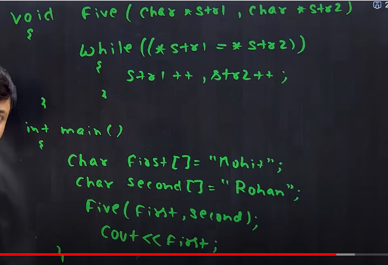

# Pointer_Codder_army
```cpp
int a = 10;

```
in a memory at a place store 10 that place name is a and , a is nothing only a unique address like 500 . so that address memory store 10 number

# how to know the address of a is like 500
by the help of **symble table** , when we declear a variable ..


# 2GB , 4GB , 8GB RAM ...
In Memory 1,1,1 BYTE Blocks
if 4GB Ram than
4GB --> 2^32 BYTE --> for this we need total 2^32 unique address .. for this we need only 32 bit os system because , by the help of 32 bit we can create the 2 ^ 32 unique 


# How to print and store appress

```cpp
int a = 10;
//stroe address
int *ptr = &a;
// read value
cout<< ptr ;
// or 
cout<< &a ;

//
float  b = 12.3;
float *ptr1 = &b;
cout<< ptr1;

```
# Size of A pointer 
if ram is 4GB than size of a pointer will be 32 bit or 4Byte
if Ram is 8GB , 16GB ....... then address will be 64 bit or 8Byte

> it does not depend on (int , float , char , double) type

# Why write int , float , char before the ptr
bcz. when we read than .. if char then read only one block , if int than read 4 block alternate memory blocks

# how to read value of with the help of address pointer 

```cpp
int a = 10;
int *ptr = &a;
// access the value with the hepl of pointer
cout<<(*ptr);
```
> in a pointer we can store multiple address but at one time one address

```cpp
int a =10;
int *ptr = &a;

int b = 12;
// imp
ptr = &b;
cout<<(*ptr) ; // 12
b = 1000;
cout<<(*ptr) ; // 1000
```

# Pointer in arr


if int arr[5] ;
int *ptr = &arr[0];
or 
int * ptr = arr
than the address of each one is 
arr = arr[0]  --> x
arr+1 = arr[1] --> x+4
arr+2 = arr[2] --> x+2*4
arr+3 = arr[3]
arr+4 = arr[4]

# cout<< arr[i] ;
  at this case first go for the address of arr[3] which will
  **address --> arr + i * dataType size** 
  and than give the value which is store at this lucation


> arr[3] == *(arr+3) == *(3+arr)  == 3[arr]

or 
int *ptr = arr;

> > ptr[3] == *(ptr+3) == *(3+ptr) == 3[ptr]


arr = &arr[0]
    = & (*(arr+0))
    = arr  

# print all the address of arr
```cpp
int arr[5] = {1,2,3,4,5};
for(int i =0;i<5;i++)
cout<< (arr+i) << " same " << &arr[i]<<endl;
```

# print all tha value 

```cpp
int arr[5] = {1,2,3,4,5};
for(int i =0;i<5;i++)
cout<< arr[i] <<" or " << *(arr+i) << " or " << *(i+arr) << " or " << i[arr]<<endl;
```

# airthmetic operation of pointer

> print array 

```cpp
int arr[5] = {1,2,3,4,5};

int *ptr = arr;

for(int i =0;i<5;i++){
    cout<<*ptr<<" ";

    ptr++; // ptr = ptr + 1
}
// or 

int *ptr1 = &arr[4];
for(int i =0;i<5;i++){
    cout<<*ptr1<<" ";
    ptr1--; // ptr1 = ptr1 - 1;
}

```
ptr = ptr + 3 ✅
ptr1 = ptr1 - 2 ✅

# BUT BUT  it's worng
arr++ ❎
arr -- ❎
arr = arr + 3 ❎

> ❎❎❎❎❎❎❎❎worng❎❎❎❎
```cpp
int arr[5] = {1,2,3,4,5};
for(int i =0;i<5;i++)
{
    cout<<*arr;
    arr++;
}
```
bcz these pointer arr , arr+1 , arr+3 are constent
if it variable then data can be lost 

>  # 👍  Pointer With Char Array
in the case of char array is diff to the 
int array

here is arr is not address it is value
```cpp
char arr[5] = "1234";

char *ptr = arr;
cout<<arr; // 1234
cout<<ptr;  // 1234

```
why --> in the char arry if address is given the nwe print the value not address threw "cout<<arr"
same is for the ptr also.

bcz of implimentation


> # How to print Address
using type casting
```cpp

char arr[5] = "1234";

char *ptr = arr;
cout<<(void*)arr;
cout<<(void*)ptr;
// or 
cour<<static_cast<void*>(arr); // give the addres

```
> # for char char it will give random ans

```cpp
char name = 'a';
char *ptr = &name;
cout<<ptr; // give random ans
cout<<&name ; // give random ans
// for address
cout<<(void*)&name; // give addres
//or
cout<<(void*)ptr: // give addres

```
# using Pointer / pass by Pointer

```cpp

void inc(int *ptr){
    // value = *ptr
    *ptr = *ptr + 1;
}

int main(){
    int num = 10;
    inc(&num);
    cout<<num; // 11
}

```
# double all the value pointer
```cpp
void dob(int *ptr){
    for(int i =0;i<5;i++)
    ptr[i] = 2*ptr[i]; // *(ptr+i) = 2*(*(ptr+i));
}
int main(){
    int arr[5] = {1,2,3,4,5};
    dob(arr);
    for(int i =0;i<5;i++)
    cout<<arr[i]<<" ";
}
```
> # Swaping using pointer
```cpp
int swaping(int *p1, int*p2){
    int temp = *p1;
    *p1 = *p2; // p1 add ki value me p2 add ki value
    *p2 = temp;
}
int main(){
    int a =4;
    int b =5;
    swaping(&a,&b);
    cout<<a<<" "<<b;  // 5 4
}
```
> # Reference Variable
give two or more than two name to a lucation is called reference variable 

# swaping using reference variable 
```cpp
void swaping(int &p1 , int &p2){
    int temp = p1;
    p1 = p2;
    p2 = temp;
}
int main(){
    int a = 5;
    int b = 4;
    swaping (a,b);
    cout<<a<<" "<<b; // 4 , 5 
}
```

# Duble the arry
```cpp
void dob(vector<int>&v1){
    for(int i =0;i<v.size();i++)
    v1[i] = 2 * v1[i]
}

int main(){
    vector<int>v(5) = {1,2,3,4,5};
    dob(v);
    for(int i =0;i<5;i++)cout<<v[i]<<endl;
}
```
in the case of array 

```cpp
// void dob(int *p)
void dob(int p[]){   
    for(int i =0;i<5;i++){
       p[i] = 2 * p[i];
    }
}

int main(){
    int arr[5] = {1,2,3,4,5};
    for(int i =0;i<5;i++)
    cout<<arr[i]<<" ";
}
```
> array always paas by reference 

> # GATE QUESTION-1
```cpp
int main(){
    char c[] = "GATE2024";
    char *p = &c;
    cout<<p+c[3]-c[1];  // 2024
    // p + 'E' - 'A' == p + 4*1(dataType) 
    // means print the all value p+4
}
```
> # question


```cpp
void second(int *p1 , int *p2){
    p1 = p2;
    *p1 = 2;
}
int main(){
    int i =0 , j =1;
    second (&i,&j);
    cout<<i<<j; // 0 2 
}
```
> # question


```cpp
int *ptr ;
int x = 0;
ptr = &x;
int y = *ptr;
*ptr = 1;
cout<< x << y; //  1 0 
```

> # Question -4


```cpp
int a =5 , int b =10;
int &home = a; // reference variable , a ka ek aur naam
int *ptr = &a;
(*ptr)++; // now a = 6
ptr = &b; // ptr has add of b
*ptr = *ptr + 5; // now b = 15
name += 5 ; // now a = 6 + 5  , a = 11
cout<<a<<b; // 11 15
```
> # double Pointer 
use for store the address of a pointer 
- use of dubble pointer is 2D array
- use of triple pointer is 3D array

```cpp
int a = 10;
int *p1 = &a;  // p1 store the address of a
int **p2 = &p1; // p2 stroe the address of p1 pointer
int ***p3 = &p2; // p3 store the address of p2 pointer
// change the value of a
**p2 = **p2 + 4;
cout<<a; // 14

***p3  = ***p3 + 10;
cout<<a; // 24

```
> n th pointer will hold the (n-1)th pointer address
 
 > # IMPORTANT
 ```cpp
 void fun(int *p1){
    p1++;
    // create new address p1 and in which 100 become 100++ means
    // 100 + 4 == 104 
 }
 int main(){
    int a = 100;
    int *p = &a;
    fun(p);
    cout<<a; // 100 not 104
 }
```
> # how to make 104 / using double pointer
```cpp
int fun(int **p1){
    *p1 = *p1 + 1;
}
int main(){
    int a = 100;
    int *p = &a;
    int **ptr = &p;
    fun(ptr);
    cout<<a; // 104
}
```

> # Question (IMPORTAT) 


```cpp
int foor(int x , int *py , int **pp2){
    // x = 4
    int y ,z;
    **pp2 +=1 ; // c = 4 + 1 , c =5
    z = **pp2;  // z = 5
    *py += 2; // c = 5 + 2 , c =7
    y = *py ; // y = 7 
    x += 3 ; // x = 4 + 3 , x =7;
    return x + y  + z ; // 7 + 7 + 5 
}

int main (){
    int c, *b , **a;
    c =4 , b = &c , a = &b;
    cout<< foor(c,b,a); // 19
}
```
> # Question 07


```cpp
void five(char *str1 , char *str2){
    // str1 point 'M' , str2 point  'R'
    while((*str1=*str2)){ // M' = 'R'
        str1++; // point 'o'
        str2++; // point 'o'
    }
    // now first wiil become 'Rohan';
    // at the last when null char than break the loop
}

int main(){
    char first[] = "Mohit";
    char Second[] = "Rohan";
    five(first,second);
    cout<<first; // Rohan
}
```
if while loop contain any thing than it's run 
at the last when it's get null char than break

> This above code the COPY String CODE

---
read about double pointer more 

> # Memory Management 